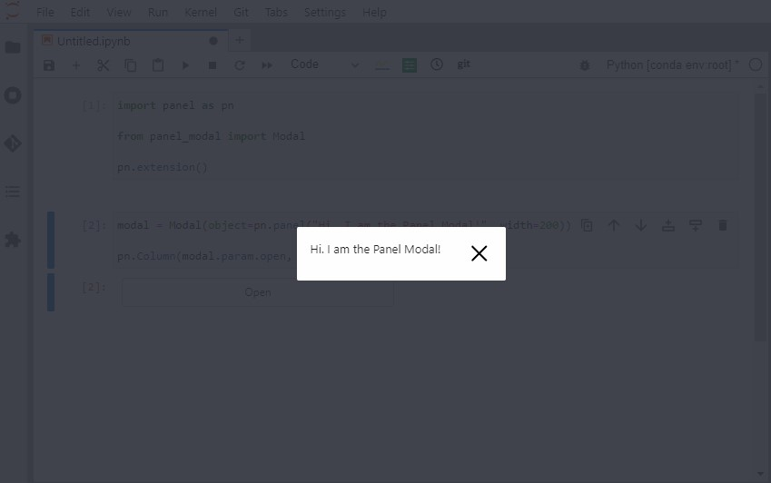

# ✨ panel-modal

We want to make it easy to use *modals* with Panel on both the server and in the notebook.

A *modal* is an element that displays in front of and deactivates all other page content. Panel
already includes a modal. But it only works if you using a *template* on a server. It does not
work in the notebook.

You can install and use the package as simple as.

```bash
pip install panel-modal
```

```python
import panel as pn

from panel_modal import Modal

pn.extension()

modal = Modal(object=pn.panel("Hi. I am the Panel Modal!", width=200))

pn.Column(modal.param.open, modal).servable()
```



Check out the [api](#api) section below and the [examples](apps) folder for more details.


## Api

### Parameters

- `object` : The object to display in the modal. You can display multiple objects by wrapping them in
a layout like a Column.
- `is_open`: Whether or not the modal is open. Set this to `True` to open the modal.
- `show_close_button`: Whether to show a close button in the modal.
- `style`: The css styles applied to the modal.

### Events

- `open`: Trigger this to open the modal.
- `close`: Trigger this to close the modal.

## 🚀 Get started in under a minute

Install `panel-modal` including the *`examples` dependencies*.

```bash
pip install  panel-modal[examples]
```

Explore the sample apps

```bash
pn hello panel-modal
```

You can now find the *reference* and *gallery* notebooks in the `examples/awesome-panel/panel-modal` folder. Check them out by running `jupyter lab`.

## 📒 Explore the examples online

Click one of the buttons

[](https://nbviewer.org/github/awesome-panel/panel-modal/tree/main/examples/)
[](https://mybinder.org/v2/gh/awesome-panel/panel-modal/HEAD)

## ⭐ Support

Please support [Panel](https://panel.holoviz.org) and
[awesome-panel](https://awesome-panel.org) by giving the projects a star on Github:

- [holoviz/panel](https://github.com/holoviz/panel).
- [awesome-panel/awesome-panel](https://github.com/awesome-panel/awesome-panel).

Thanks

## ❤️ Contribute

If you are looking to contribute to this project you can find ideas in the [issue tracker](https://github.com/awesome-panel/panel-modal/issues). To get started check out the [DEVELOPER_GUIDE](DEVELOPER_GUIDE.md).

I would love to support and receive your contributions. Thanks.

[](https://github.com/awesome-panel/panel-modal/issues).

## Monitor

[](https://pypi.org/project/panel-modal/)
[](https://pepy.tech/project/panel-modal)

[](https://opensource.org/licenses/MIT)

